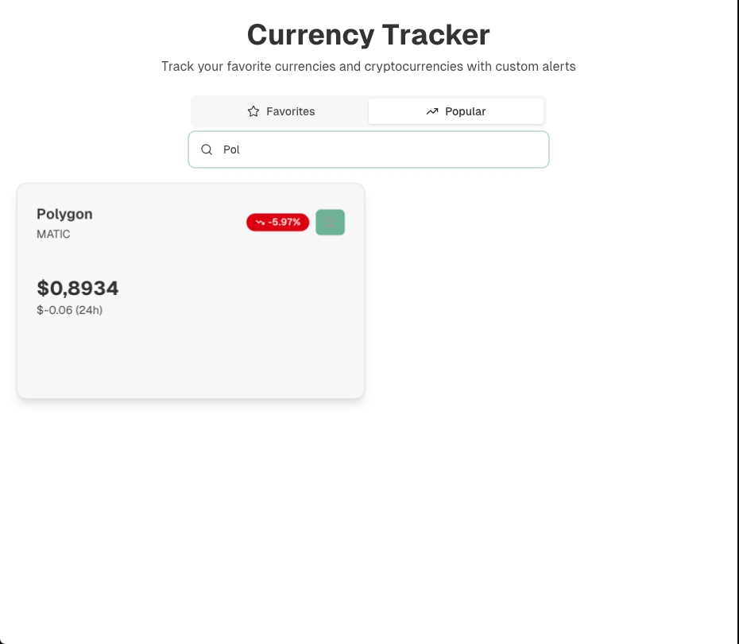

# Проект по Конструирование программного обеспечения

**За реализацию отвечают студенты группы 5130904/30108:** Петухов Кирилл, Аракелян Даниил, Полелейко Иван

**Название проекта:** Crypto Tracker — приложение для отслеживания криптовалют

**Цель проекта:** Создать минимально жизнеспособное приложение, которое позволяет пользователю отслеживать курсы выбранных криптовалют, получать уведомления о значимых изменениях и быть в курсе актуальной информации о рынке.

**Возможности приложения:**

1. Просмотр популярных валют, графиков с ценой, сохранение выбранной валюты в “Избранное”.
2. Уведомление в ТГ боте при изменении стоимости валюты: + или -, в процентах, процент выбираете Вы.
3. Портфель + инвестиции
    1. Возможность добавить «виртуальный портфель» в профиле (сумма покупки + количество монет) и следить за прибылью/убытком.
    2. Подсказки: «Ваш портфель просел на 10% за неделю, хотите выставить стоп-уведомление?».
4. Разные сценарии уведомлений: «инвестор» (редкие отчеты), «трейдер» (частые сигналы).
5. Изменение темы оформления веб приложения (темная/светлая)
6. Интеграция с телеграмм ботом (/alert BTC 0.01%) + уведомления

**Реализация:** Telegram bot + Web Ui

**Стек:** Python + FastAPI, TypeScript, PostgresQl

**Ссылка на репозиторий:** https://github.com/CryptoTracker-pi8/crypto-tracker

**Макет:**

## Юзер стори

1. Как пользователь я хочу просматривать цены и графики валют.
2. Как пользователь я хочу сохранять определенные валюты, чтобы не терять их из виду.
3. Как пользователь я хочу отслеживать стоимость “Избранной” валюты. Получать уведомления в телеграмм боте при изменении стоимости валюты в определенный + или - процент.
4. Как пользователь я хочу иметь возможность взаимодействовать с приложением через команды в телеграмм боте, чтобы постоянно не открывать веб интерфейс приложения. (/status BTC, /alert BTC 0.01 (+-%) и т п)
5. Как пользователь я хочу иметь виртуальный портфель для отслеживания его состояния. 
6. Как пользователь я хочу получать информацию по состоянию своего портфеля.
7. Как пользователь я хочу иметь возможность кастомизации темы веб приложения.
