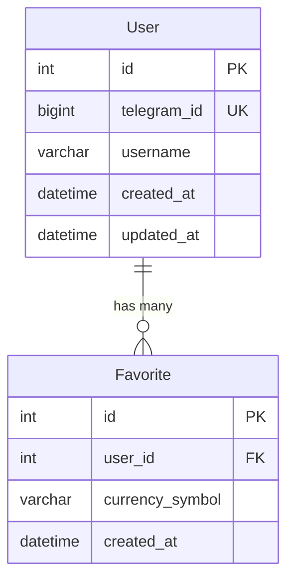
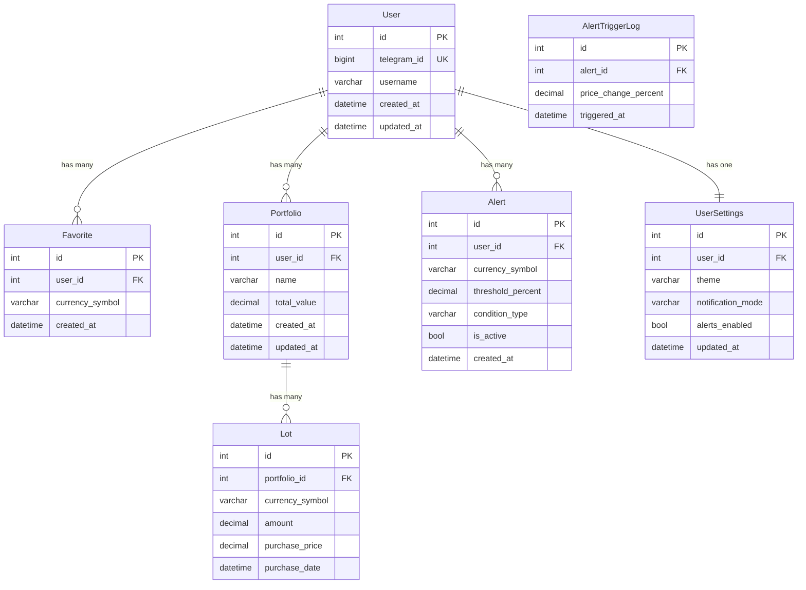

## Диаграмма отношений моделей базы данных Crypto Tracker

### Текущие реализованные модели

### Полная архитектура моделей (планируемые)

### Описание отношений

1. **User ↔ Favorite** (1:N)
   - Один пользователь может иметь множество избранных валют
   - Каскадное удаление: при удалении пользователя удаляются все его избранные валюты

2. **User ↔ Portfolio** (1:N) - планируется
   - Один пользователь может иметь множество портфелей
   - Портфель содержит виртуальные инвестиции пользователя

3. **Portfolio ↔ Lot** (1:N) - планируется
   - Один портфель может содержать множество лотов (инвестиций)
   - Лот представляет конкретную покупку определенной валюты

4. **User ↔ Alert** (1:N) - планируется
   - Один пользователь может создать множество алертов на уведомления
   - Алерты срабатывают при изменении цены валюты на заданный процент

5. **Alert ↔ AlertTriggerLog** (1:N) - планируется
   - Один алерт может иметь множество записей срабатываний
   - Лог хранит историю активации алертов

6. **User ↔ UserSettings** (1:1) - планируется
   - Один пользователь имеет одни настройки
   - Настройки включают тему интерфейса, режим уведомлений и т.д.

### Текущее состояние реализации

- ✅ **User** - полностью реализована
- ✅ **Favorite** - полностью реализована
- ❌ **Portfolio** - запланирована (фаза 2)
- ❌ **Lot** - запланирована (фаза 2)
- ❌ **Alert** - запланирована (фаза 3)
- ❌ **AlertTriggerLog** - запланирована (фаза 3)
- ❌ **UserSettings** - запланирована (фаза 3)

### Технологии

- **ORM**: SQLAlchemy 2.0 с асинхронной поддержкой
- **База данных**: PostgreSQL
- **Миграции**: Alembic (запланировано)
- **Кэширование**: aiocache для API ответов
